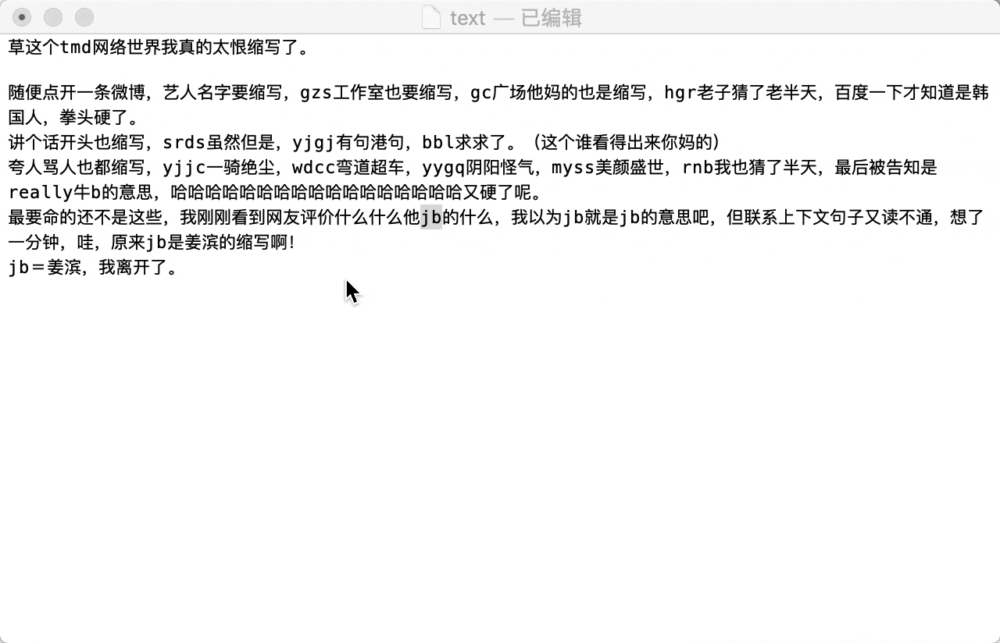

# 「能不能好好说话？」 的PopClip 插件版本

基于[@itorr](https://github.com/itorr)的[能不能好好说话？](https://github.com/itorr/nbnhhsh)，制作的PopClip 插件版本
可以很方便的查询各种缩写

## 安装
需要首先安装PopClip,
从 [Releases](https://github.com/qazhuhuihao/nbnhhsh.popclipext/releases) 下载文件，双击即可完成安装

## 栗子

## 致谢
- [能不能好好说话？](https://github.com/itorr/nbnhhsh):  拼音首字母缩写翻译工具